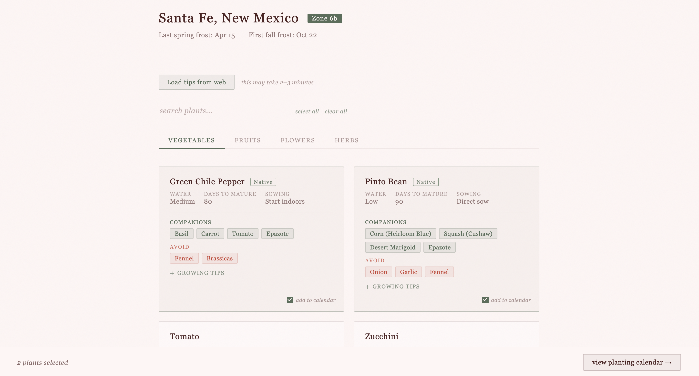
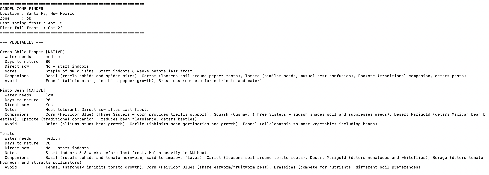
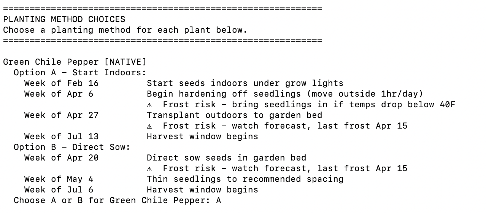

# Garden Zone Finder

[](https://garden-zone-finder.onrender.com)

A web app (and CLI tool) that helps gardeners find what grows in their USDA hardiness zone — with a generative watercolor landing page, tabbed plant report, companion planting guidance, week-by-week planting calendar, and optional live-scraped growing tips.

**[→ Try it live at garden-zone-finder.onrender.com](https://garden-zone-finder.onrender.com)**

Built for zone 6b (Santa Fe, NM) but works for any US zip code.

---

## Features

- **Zip code → USDA zone lookup** — instant hardiness zone from any 5-digit US zip
- **Frost date calculation** — last spring frost and first fall frost dates per location
- **50-plant database** — vegetables, fruits, flowers, and herbs suited for zones 5a–9b
- **Region-aware native tagging** — plants flagged `[NATIVE]` based on your specific US region (Southwest, Great Plains, Northeast, Southeast, Midwest, Northwest, California)
- **Live web scraping** — optional zone-specific growing tips pulled from major gardening sites
- **Week-by-week planting calendar** — action dates with frost risk warnings built in
- **Dual schedule option** — for plants that can be started indoors or direct sown, shows both paths with tradeoffs so you can choose per plant
- **Companion planting guidance** — companions and avoid lists with reasons for every plant
- **Save to .txt** — export plant report and/or planting calendar to a text file (CLI)

---

## USDA Hardiness Zone Map

Plant zones are based on the official USDA Plant Hardiness Zone Map.

[View the official interactive map →](https://planthardiness.ars.usda.gov/)

Santa Fe, NM falls in Zone 6b (average annual minimum temperature -5°F to 0°F).

---

## Installation

**Requirements:** Python 3.9+

```bash
# Clone the repo
git clone https://github.com/smariewebster/garden-zone-finder.git
cd garden-zone-finder

# Create and activate virtual environment
python3 -m venv venv
source venv/bin/activate  # Mac/Linux

# Install dependencies
pip install -r requirements.txt
```

### Run the web app

```bash
python3 app.py
```

Then open `http://localhost:5000` in your browser.

### Run the CLI

```bash
python3 main.py
```

You will be prompted to:

1. Enter your zip code
2. View your USDA zone and frost dates
3. Choose whether to scrape live tips from the web (~2 min)
4. View your plant report (with companion planting info)
5. Optionally save the report to a `.txt` file
6. Optionally generate a week-by-week planting calendar
   - For plants that can be started indoors or direct sown, you'll choose a method per plant
7. Optionally save the calendar to a `.txt` file

---

## Plant Database

50 plants across four categories:

| Category   | Count |
|------------|-------|
| Vegetables | 20    |
| Fruits     | 10    |
| Flowers    | 15    |
| Herbs      | 5     |
| **Total**  | **50**|

Each plant includes:
- Water needs and days to maturity
- Direct sow vs. start indoors recommendation
- `weeks_before_frost` for indoor start timing
- `cool_season` flag for pre-frost direct sow crops (carrots, peas, beets, etc.)
- Native region tags (7 US regions)
- Companion planting suggestions and plants to avoid
- Planting notes

Native Southwest species include Green Chile Pepper, Pinto Bean, Epazote, Desert Willow, Four O'Clock, and more.

---

## Data Sources

- **USDA zone data** — [phzmapi.org](https://phzmapi.org) (zip-keyed S3 bucket)
- **Location data** — pgeocode (zip → city, state, lat/lng)
- **Growing tips scraped from:**
  - Old Farmer's Almanac
  - NMSU Extension (nmsu.edu)
  - High Country Gardens
  - Gardening Know How
  - Planet Natural

---

## Project Structure

```
garden-zone-finder/
├── app.py                # Flask web app entry point
├── main.py               # CLI entry point
├── zone_lookup.py        # Zip → zone + frost dates
├── plants.py             # 50-plant database with companion data
├── scraper.py            # DuckDuckGo + BeautifulSoup web scraping
├── organizer.py          # Tip organization + report formatting
├── planting_calendar.py  # Week-by-week calendar with dual schedule support
├── templates/            # Flask HTML templates
│   ├── index.html        # Watercolor landing page
│   ├── report.html       # Tabbed plant report
│   └── calendar.html     # Planting calendar
├── static/               # Static assets (favicon)
├── requirements.txt      # Dependencies
└── README.md
```

---

## Screenshots


*Garden animation landing page*


*Tabbed plant report with search and companion planting*


*Plant report with companion planting guidance and live-scraped growing tips*


*Week-by-week planting calendar with indoor vs. direct sow options and frost risk warnings*

---

## Contributing

Plant database contributions welcome — especially:
- Additional native Southwest species
- Plants for zones outside 5a–9b
- Corrections to companion planting data

Open a PR or file an issue on GitHub.

---

## Built With

- [Python 3.9](https://www.python.org/)
- [Flask](https://flask.palletsprojects.com/)
- [BeautifulSoup4](https://www.crummy.com/software/BeautifulSoup/)
- [pgeocode](https://pgeocode.readthedocs.io/)
- [Render](https://render.com) — hosting
- Vanilla JS — no frontend frameworks

---

## License

MIT
